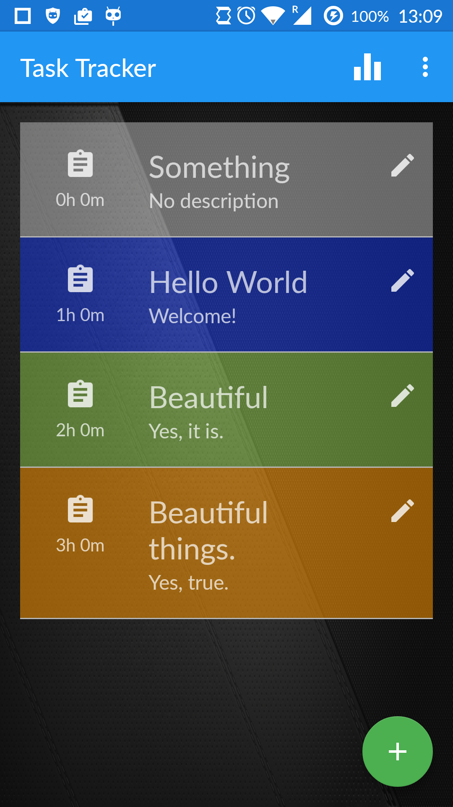
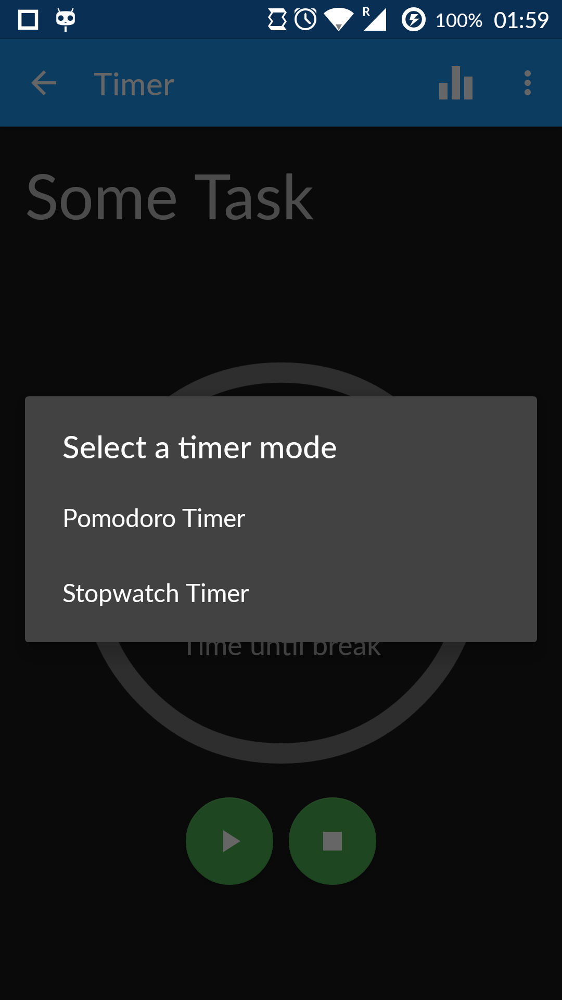
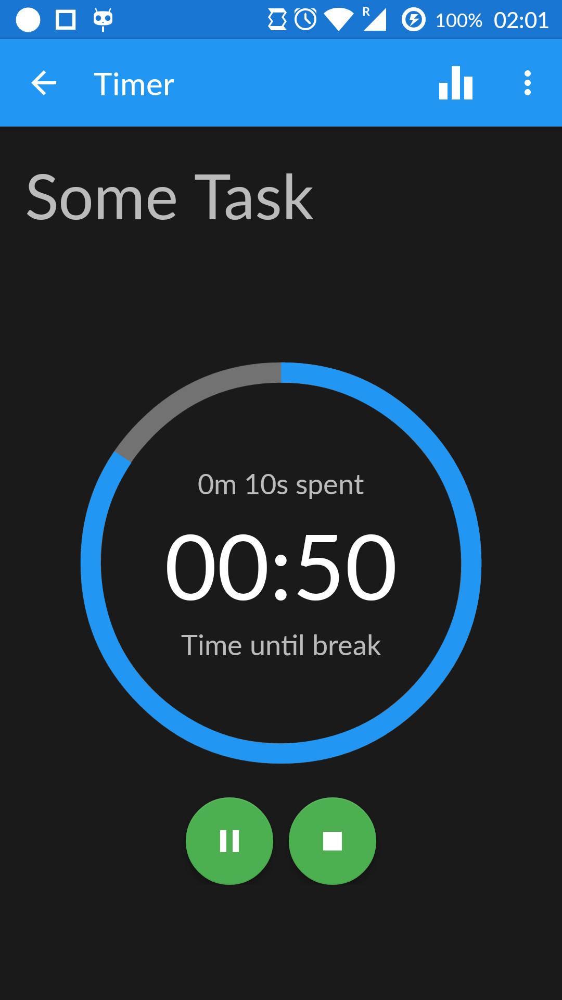
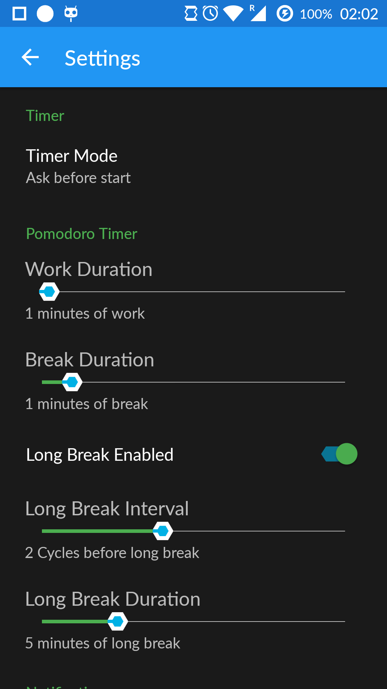

# TaskTracker
Task Tracker is an android application which allows managing tasks and running wo different timers to measure time and/or to keep focused and motivated.

<b>Two timer modes:</b>
* Stop Watch
* Pomodoro

<b>Features:</b>
* Creating, Editing and Deleting of tasks
* Task: Name, Description, Estimated Time, Spent Time
* Individual Colors for tasks
* Interactive Timer with circle animation
* Settings for timer periods, long breaks and notifications
* Notifications of current timer and when finished

  
  
  
  

<b>Future Improvements/Features:</b>

* Archive mode to archiv task which are finished
* Statistics page with graph
* Donation feature
* Online-Backup/Restore
* Offline-Backup/Restore
* Share tasks with friends
* Subtasks for main tasks

